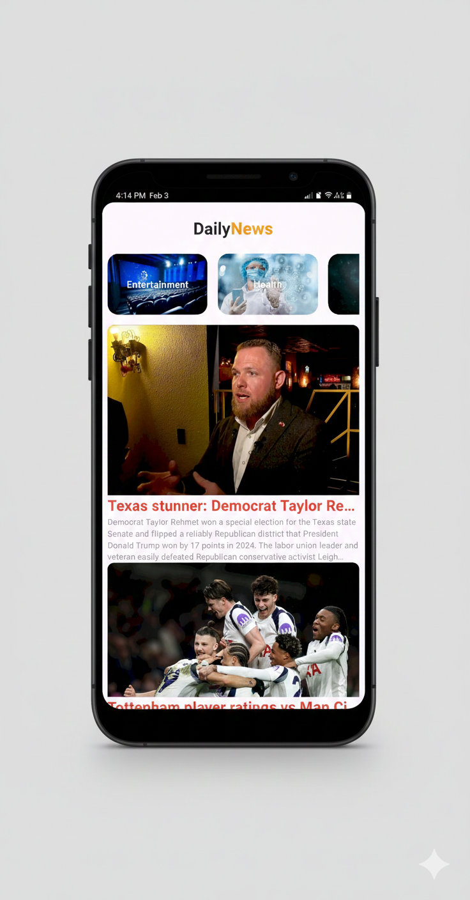
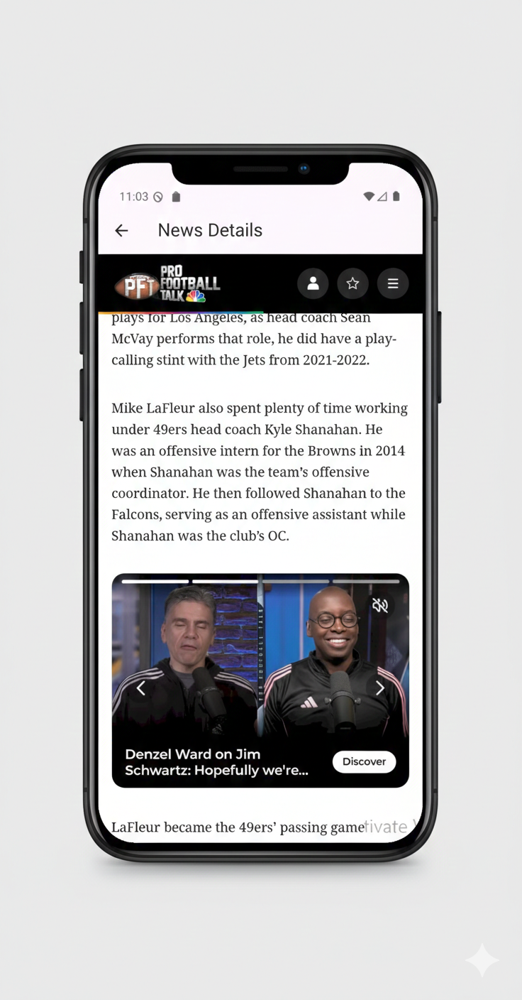

# News App (Flutter)
A modern Flutter news application that fetches real-time news articles using a public News API. The app provides a clean user interface and smooth browsing experience, allowing users to explore the latest news across different categories.
This project demonstrates REST API integration, asynchronous data handling, and responsive UI design using Flutter.

# Features
🗞 View latest news articles
📂 Browse news by categories (Business, Sports, Technology, Health, etc.)
🌐 Real-time data fetching from REST API
📱 Responsive UI for multiple screen sizes
⚡ Smooth scrolling and fast performance

# Technologies Used
-Flutter
-Dart
-REST API
-HTTP Package
-Material UI

## 📸 Screenshots

# APP Demo
https://github.com/user-attachments/assets/f5c774a9-0fb9-4dd0-b6cd-3c30aaf22cd5

# Developer
Samar Alsallal
Flutter & Mobile Developer
GitHub: https://github.com/SamarAlsallal

https://github.com/user-attachments/assets/f5c774a9-0fb9-4dd0-b6cd-3c30aaf22cd5

